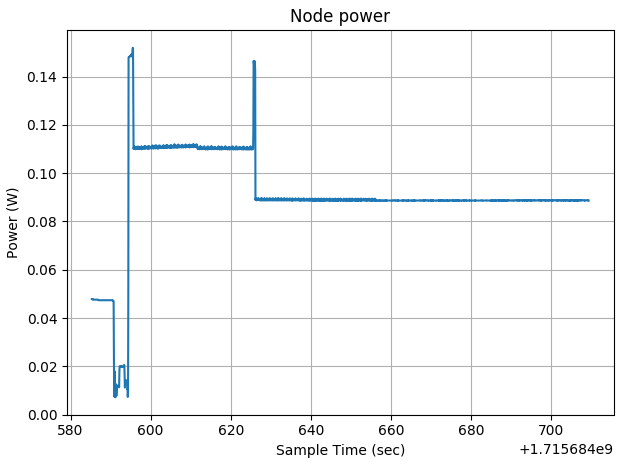
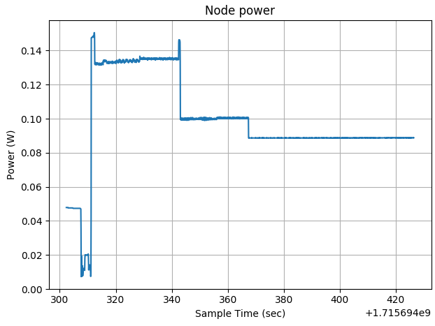
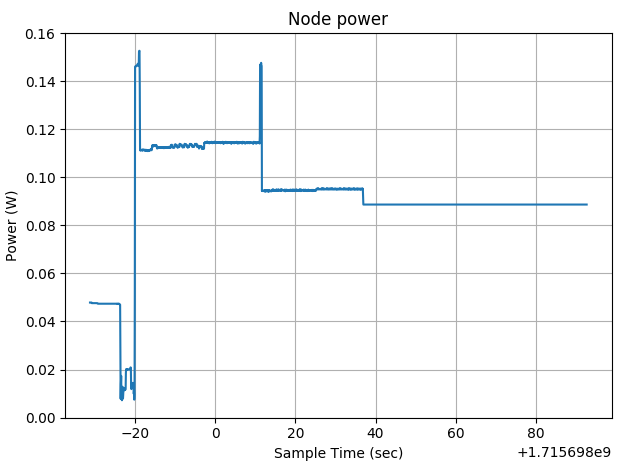
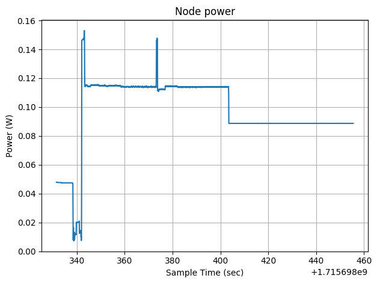

# Individual Assignment, IoT 2024
Adrian Gheorghiu - 2162607

I implemented the task in both IoT-LAB (the part with power measurement) and on the physical board (for virtually everything else). Problem with IoT-LAB is that there is no MQTT library and also the nodes seem isolated with the only method of communication being through the TCP broker that sends the message through UART. Hence why, I also implemented it for the physical device, where I have MQTT but no power draw measurement tool. To keep it simple, for the physical device I only implemented the hardcoded version.

## 1. Signal generation
### 1.1 IoT-LAB TCP UART
Initially, I implemented this method on IoT-LAB by using the UART character RX handler and reading bytes until they form a complete float value (data is assumed to be received in little endian form), which is every 4 bytes. This way, the bytes are first accumulated in an auxiliary variable and then copied over in a global variable called "sensor_value" which represents the updated sensor value. Incomplete reads of the variable (for example reading half of the old value and half of a new value) are impossible in this scenario as both the IoT-LAB M3 and ESP32 microprocessors are 32-bit and guarantee atomicity of all 32 bit variables. The data race is not a problem, since, worst case, the old sensor value is read just before update of the new value in memory. Some problems with this method include having to decide on a frequency the values are sent at (in theory it should be double then the maximum frequency the board samples at) and also that a delay must be introduced between starting the experiment and sending the values, otherwise the board might miss a couple of bytes and then all following float values will be corrupted (unless the missed number of bytes is divisible by the size of the float).

With this method I ran into another interesting problem. I first tried printing the generated signal to STDOUT (in a python program, of course) and then piping it through netcat (nc), but the results ended up being very bad with the received signal looking very blocky. I first chalked it up to network delay inconsistencies, but it turned out that the problem was not intrinsic to the network itself, but it was due to Nagle's algorithm, which introduces delay into the TCP sends and waits for data to accumulate to send bigger packets at once. The netcat utility has this algorithm enabled by default, so the connection had to be made through sockets directly with the TCP option TCP_NODELAY set to true to disable Nagle's algorithm.

### 1.2 Hardcoded signal
This version was the one used for all experiments, as it works better with the power measurement tools on IoT-LAB and is much easier to implement on the physical board than reading values from TCP or UART. The signal can be defined in the "sample_signal" function as a sum of "sine" functions. The sine function samples a sinusoid of amplitude "A" and frequency "f" at time "t", according to the following formula: $$A\ sin(2 \pi f t)$$
During power consumption experiments, I noticed that, at a constant sample frequency, different input frequencies would yield different power consumptions. This is because the math.h "sinf" function is implemented in through branches which are chosen based on how big the input number is. Thus, for small input numbers, the function is way faster than for big numbers. To fix that, I shifted the sine input by the initial maximum sample frequency so that, regardless of frequency, all samples will be taken from roughly the same order of magnitude: $$A\ sin(2 \pi \times INITIAL\_SAMPLE\_FREQ \ + 2\pi f t)$$
This hardcoded version showed similar results to the previous version, so there was no improvement that came with having the signal instantly available.

## 2. Maximum sampling frequency
For sampling the signal at a given frequency, I made use of the vTaskDelay RTOS function that delays the current task for a given amount of ticks. At every system tick, FreeRTOS checks whether any task needs to be woken up, so a higher tickrate means more work for the server, so the limit that the tickrate can be set in the esp-idf config is 1000Hz. FreeRTOS ticks are used to measure real time as well, so the timer interrupt that increments the ticks is made with strict temporal accuracy in mind, which means it's somewhat reliable for sampling. The default tickrate for FreeRTOS in esp-idf is 100Hz. I increased it to the maximum resolution of 1000Hz by changing the value of the config variable "CONFIG_FREERTOS_HZ". This gives us a maximum sampling frequency of 1000Hz. For the sake of simplicity, I chose this method to emulate sampling from an actual ADC and thus set the default initial sampling frequency to 1kHz in the code. A more complex method would have been to use a hardware timer with a small prescaler value to really achieve very high frequencies, but for experimental purposes the vTaskDelay method will make do.

## 3. Identifying optimal sampling frequency
For the FFT, I snatched an FFT implementation from [this](https://www.math.wustl.edu/~victor/mfmm/fourier/fft.c) link and I modified the definition for the complex numbers to also accommodate representing the numbers in polar coordinates. This was achieved using C unions. A couple of things to notice about this basic FFT implementation is that it only works for inputs which are a power of 2 and also that it is less efficient because it does superfluous copies of the signal (which could be avoided with a bit reverse trick for example). For getting the maximum frequency that is present in the signal, I first apply the FFT on 256 sampled values (which will give us a 3.90625Hz bin resolution with the 1000Hz initial sampling rate) and extract the magnitude from the result. I then find the dominant frequency magnitude by getting the largest value out of all magnitudes in the first half of the FFT. After that, I find the rightmost frequency in the first half that has a magnitude at least that of the dominant frequency's times some multiplier (chosen as 0.1 by default). The search is done only in the first half because the second half represents the negative frequency responses and in the case of real input signals, it is a mirror of the first half. The maximum frequency is found using a threshold (dominant frequency magnitude times a multiplier) because even the bins of the frequencies not found in the signal will be non-zero due to spectral leakage (from sampling incomplete periods of the signal) and rounding errors.

## 4. Computing and sending aggregate
This part is done only in physical board implementation. Once the sampling frequency has been adjusted to twice the maximum frequency, the aggregates of the samples are computed as the average over a rolling window (with 5 samples per window as the default value). Once an average is computed, it is sent through MQTTS to a mosquitto server running on the edge (my laptop). The connection is secured through TLS, with certificates and RSA keys generated locally using OpenSSL for the Certificate Authority, server, and client. No authentication method is used, so clients are anonymous. The aggregate is sent in a json format with the string for the aggregate padded so that it takes up exactly 10 bytes. Note, that if the value is either too big (1000 and above) or too small (-100 and bellow), it will occupy more than 10 bytes, but this is only a problem for computing the exact volume of data sent over the network. Thus, the total message length will ocupy exactly 23 bytes if the value is kept in the aforementioned ranges.

## 5. Measuring the performance of the system
### 5.1 Energy savings
This part is done only in the IoT-LAB implementation. To measure power draw, I used the IoT-LAB power consumption monitoring tool. I do this by running a 2-minute experiment with a code that samples for 30 seconds at the initial maximum frequency, applies FFT to get the maximum frequency and then samples again for 30 seconds at the new adjusted frequency. After that, the "plot_oml_consum" tool is used to get a plot of power consumption over time.
### 5.2 Volume of data transmitted over the network
The volume of data is measured in bits per second (b/s). Considering we use a rolling window, whose size doesn't affect the volume of data sent, the volume can be obtained simply by multiplying the sampling frequency with the message length and the number of bits per byte, which is 8.
### 5.3 Latency
For measuring the latency, a symmetric client-server latency is assumed, meaning the time taken for the message to reach the server from the client is considered equal to the time taken for the message to reach the client from the server. This way, we can measure the latency by measuring the time from sending the message and receiving it back again (known as round-trip time or RTT) and dividing it by 2. For this, the client can be subsribed to the same topic that we post to. Once a new aggregate is computed, the timer is started, the client publishes the message, waits to receive a response and then stops the timer to get the RTT, which it divides by 2 to get the latency. As latency fluctuates a lot, I compute the average latency over a default of 100 messages. It is of note that even with 100 messages, the average will still have fairly high variance. Still, I tried to keep the experimental setup the exact same for all tests, with the board, laptop and mobile hotspot in the exact positions to keep the WiFi network consistent. Still, I cannot have control over radio noise, contention of 802.11 frequency bands, and other packets sent in the network that might delay our packets.

## 6. Performance measured for 3 signals
I measured the performance of 5 signals (all experiments can be found in the 'experiments' folder), but here I will present the performances of the 3 I believe to be more important.

### 6.1 $sin(2\pi t)$
This is the sine with unit amplitude and frequency. Running it through the program, the sampling frequency gets adjusted to 7.8125Hz. This is because of the limit in bin resolution.

The power consumption with sampling 30 seconds at maximum sampling frequency and 30 seconds at the adjusted frequency is the following:

The initial decrease and then the big spike is when the board is starting up and being flashed, which we ignore. Thus, at the initial frequency, the consumption is around 0.11W, then there is a spike that shows us maximum consumption while the FFT is computed, ant then after the frequency adjustment, the power consumption rests at around 0.09W. The power saving is of about 0.02W or around 18%. We can also notice how at the adjusted sampling frequency, the power draw is almost the same as the idle power draw (as after the sampling is completed, all tasks are deleted).

For the data volumes, the initial volume is 184000b/s, and the volume after adjusting the frequency is 1437.5b/s. The volume for the adjusted frequency is 128 times smaller, which is a very large increase.

For the delay, I got an average delay over 100 messages of 0.073037s. It is of note that this delay is so high because there seemed to be a way bigger delay every 10 messages or so. This suggests that the mosquitto server has some weird optimization tactic depending on the rate at which it receives messages, as it didn't happen with higher frequencies.

### 6.2 $sin(2 \pi 10 t) + 0.1sin(2 \pi 100 t)$

This signal is composed of a sine with unit amplitude and frequency 10 and a sien with 0.1 amplitude and frequency 100. Running it through the program, the sampling frequency gets adjusted to 203.125Hz.

The power consumption with sampling 30 seconds at maximum sampling frequency and 30 seconds at the adjusted frequency is the following:

It is worth to note how the power consumption at the initial frequency is higher than the previous signal. This is because, when sampling, 2 sines need to be computed. Actually, if we were to compare it to the power consumption of the signal $sin(2 \pi 100 t)$ that has the same maximum frequency, and thus the same adjustment, we would notice the the power consumption relative to the idle power consumption is roughly double (because 2 times as many sines are sampled):

Going back to our composed signal, at the initial frequency the consumption is around 0.135W, while for the adjusted frequency, the consumption is around 0.1W. The power saving is around 0.035W, or 26%. For the signal made up of only 1 sine, at the initial frequency the consumption is around 0.115W, while for the adjusted frequency, the consumption is around 0.095W. The power saving is around 17%. We can also now observe that there is very noticeable difference in power draw between idling and sampling at the adjusted frequency.

For the data volumes, the initial volume is 184000b/s, and the volume after adjusting the frequency is 37375b/s. The volume for the adjusted frequency is 4.923077 times smaller, which is what we would expect by decreasing the sampling frequency 5 times.

For the delay, I got an average delay over 100 messages of 0.025659s. Unlike for the previous signal, the delays making up the average didn't show any outliers and were pretty consistent, so it would be safe to assume that this is around the true delay of the system. Smaller frequencies experience stutters (even for the 10Hz signal for which the sampling frequency is adjusted to 20Hz), and way higher frequencies than this will be too high and communication will be bottlenecked.

### 6.3 $5sin(2\pi 500 t)$

This signal is at the maximum frequency that can be resolved by our system, 500Hz, and has an amplitude of 5. Running it through the program, the sampling frequency gets adjusted to 976.5625Hz. We can notice that for a frequency as high as this, the accuracy of getting the maximum sampling frequency drops. It is worth of note that in the case of our experimental setup, the actual sampling frequency will stay exactly the same as the delay time gets rounded down to 1 tick which means 1kHz.

The power consumption with sampling 30 seconds at maximum sampling frequency and 30 seconds at the adjusted frequency is the following:

We notice that power consumption, as expected, stays the same for both the initial frequency and the adjusted frequency at around 0.115W. Here no power saving could be made as this signal pushes the sampling rate to the limit.

For the data volumes, the initial volume is 184000b/s, and the volume after adjusting the frequency is 179687.5b/s. The volume for the adjusted frequency is 1.024 times smaller. We expected no adjustment whatsoever, but the FFT accuracy error might result in slightly incorrect sampling of the signal.

For the delay, I got an average delay over 100 messages of 0.033133s. We can see that this is around the same value as for the previous signal, but a bit higher. We could argue that the system might start to get a bit overwhelmed by the messages, but considering the high variance in delays, it is hard to tell.

## 7. How to run
### 7.1 IoT-LAB
To run the experiments on IoT-LAB, the contents of iotlab/main (in the repo) need to be copied in a new example folder under openlab/appli/iotlab_examples (on IoT-LAB). Then the steps of changing Makefiles and CMakeLists files to be able to build that project using the main openlab/build.m3 Makefile must be followed on IoT-LAB. After that, the contents of iotlab/Makefile (in the repo) must be appended to openlab/build.m3/Makefile (on IoT-LAB). These rules will give us the possibility of running the experiments easier. The 2 files "send_stdout.py" and "send_tcp.py" under the iotlab folder (in the repo) must be also copied to openlab/build.m3 (on IoT-LAB). These python scripts are used to generate the signal in case of wanting to use this mode of providing the signal. In order to run the experiments, after submitting an experiment on IoT-LAB, the node id must be first set with "export NODE_ID=(your id here)". To run the version with the hardcoded signal, the "SAMPLE_HARDCODED" macro must be set to 1 in the source file, and then "make run_individual_asignment_hardcoded" must be executed in openlab/build.m3. To run the version with the signal sent from the python script, the "SAMPLE_HARDCODED" macro must be set to 0 in the source file, and then either "make run_individual_asignment_python_stdout" or "make run_individual_asignment_python_tcp" must be executed in openlab/build.m3, depending on which version needs to run, the one that prints to STDOUT and uses netcat, or the one that uses sockets directly with Nagle's algorithm disabled. To get the consumption plot, "make plot_consumption" can be run. In the python scripts, the signal is defined in the "sensor_sample" function. for the hardcoded version, the signal is defined in the "sample_signal" function.

### 7.2 Physical board
To run the experiments on the physical board, the mosquitto server must first be started using "make mosquitto_run_broker" in the "physical" directory. The experiment can then be run using "make run_individual_assignment". To check the reception of the aggregates from the board, "make mosquitto_sub_topic" can be run, but the MQTT_SERVER_ADDRESS variable in the Makefile has to be set to the correct address.